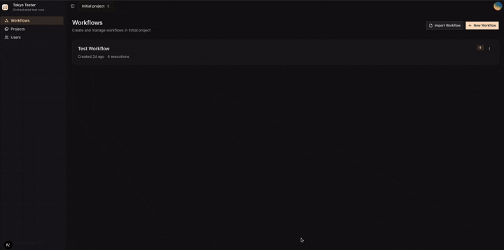

# Tokyo Tester

Tokyo Tester is a local-first end-to-end testing tool for service graphs and the infra they depend on.

You build workflows in the UI, run them through the Go runner, and keep workflow definitions, executions, logs, and test results synced back into the app.

If you want a higher-level walkthrough of how the pieces fit together, see [How the system works](./docs/system-overview.md).

## Preview



## Try The Sample Workflow

If you want to get a feel for the product quickly, import [`test-workflow.json`](./test-workflow.json) into the UI.

Before importing it, build the sample API image the workflow expects:

```bash
docker build -t bun-user-api:latest ./test-api
```

In the workflow list, use **Import Workflow**, then select the file. It gives you a ready-made example with:

- a service graph
- a PostgreSQL dependency
- HTTP and database tests
- scenarios that show how runs are organized

## What It Does

- Build workflow graphs in the UI
- Provision services and dependencies through the runner
- Execute tests against the running stack
- Track workflow runs, logs, and results
- Persist workflow definitions locally first, then sync them to the backend
- Recover execution state from the backend when realtime delivery misses a beat

## How It Works

- `ui-v2` is the Next.js app for editing workflows, scenarios, and executions
- `runner-v2` is the Go service that provisions containers, runs tests, and cleans up
- `docker-compose.yml` wires the UI and runner together with separate SQLite volumes
- the frontend sync layer persists queued edits locally, flushes them to `POST /api/v1/sync/batch`, and hydrates from `GET /api/v1/sync/pull/{clientId}`
- the runner's embedded SQLite worker coordinates execution, persists checkpoints, and streams replayable SSE updates to the UI

## Production Notes

- `make prod` builds the standalone UI image and runs the production-like stack
- the UI still uses Bun for app scripts, but database migration runs through `node ./src/db/migrate.mjs` because `better-sqlite3` is a Node-only runtime dependency
- workflow definitions are synced from the browser, while execution-owned records like workflow runs, scenario runs, and test results are treated as backend-owned during execution
- if you have an old UI image cached, rebuild the service before retesting production behavior:

```bash
docker compose build --no-cache ui
```

## Getting Started

The easiest way to run everything locally is with Docker:

```bash
make dev
```

That starts the dev stack with the UI and runner.

Useful commands:

```bash
make prod
make check
make down
make reset # also deletes local database volumes
```

If you want to run pieces manually, the main environment values live in [`.env.example`](./.env.example).

Common ports:

- UI: `http://localhost:3000`
- Runner API when using the host-runner development fallback: `http://localhost:8080`

## Built With

- Next.js
- React
- Zustand
- SQLite durable worker
- Go
- Chi
- Docker
- testcontainers-go

## Notes

- The project is still local/self-hosted by default.
- You do not need a deployed demo to explore the code or understand the workflow.
